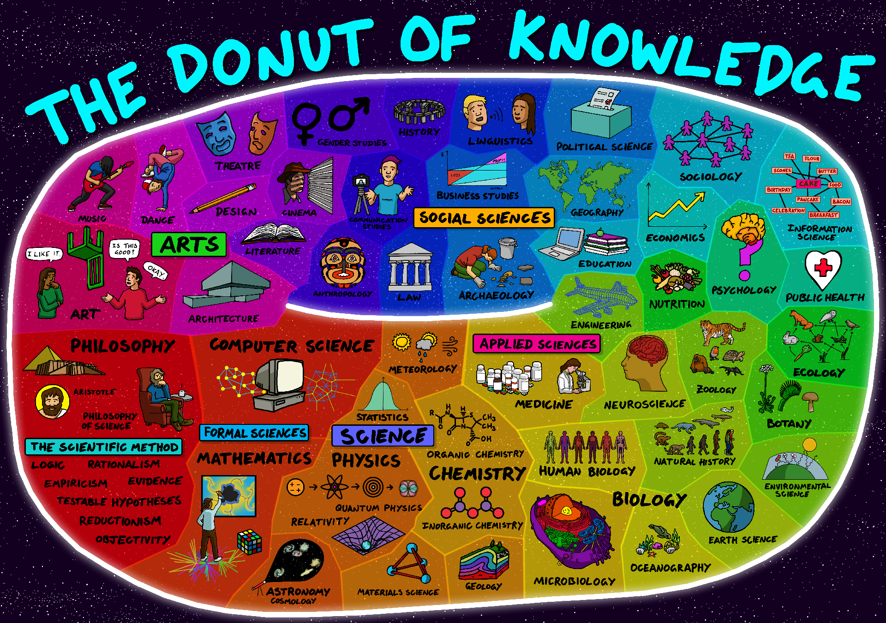

# ScienceLinks

## Table of contents

1. [Presentation](#presentation)
2. [Conferences](#conferences)
3. [Youtube channel](#youtube-channels)
4. [Documentaries and interviews](#documentaries-and-interviews)
5. [Papers](#papers-)
6. [Books](#books)
7. [Magazines](#magazines)
8. [Websites](#webites)
9. [Solo videos](#solo-videos)

## Presentation

 

 <i>Artist : https://www.flickr.com/photos/95869671@N08/</i>

 

>This is a list of links I want to keep, channels I follow on youtube, books I've read... I want to share those in case someone is looking for informations. This list will mostly contains science stuff, mainly maths, physics and computer science.

## Conferences

### -->General stuff :

- [Uncle bob's lessons](https://www.youtube.com/watch?v=7EmboKQH8lM&t=15s&ab_channel=UnityCoin) (6 videos about clean code, tests, ethics... )
- [Elon Musk about climate](https://www.youtube.com/watch?v=BMskI6G9ty0&t=2757s&ab_channel=Universit%C3%A9Paris1Panth%C3%A9on-Sorbonne) (conference about the future of earth, carbon, climate...)
- [Elon Musk Neuralink demonstration](https://www.youtube.com/watch?v=iOWFXqT5MZ4&ab_channel=CNET) (demonstration of neuralink on pigs)
- [Cédric Villani about ideas](https://www.youtube.com/watch?v=prpoogz36Sc&ab_channel=USIEvents) (french conference about how ideas are born)
- [Cédric Villani about maths](https://www.youtube.com/watch?v=rLFUnCUyPko&ab_channel=HECParis) (french conference about general uses of maths...)
- [Etienne Klein why maths](https://www.youtube.com/watch?v=YQMhrVSR6X0&ab_channel=ObservatoireMidi-Pyr%C3%A9n%C3%A9es) (french conference, can we understand why maths are useful)
- [Etienne Klein science philosphy lecture](https://www.youtube.com/watch?v=NA2XOTSTs8w&ab_channel=CentraleSup%C3%A9lec) (french conference about science philosophy and why you should read books)
- [I let algorithms randomize my life](https://www.youtube.com/watch?v=eKkI6-HeWXo&ab_channel=TED) (TED talks about randomizing your life with algorithms)

### -->Artificial Intelligence :

- [Cédric Villani about AI](https://www.youtube.com/watch?v=0Ag9yA7MpQU&ab_channel=EPFIng%C3%A9nieurs) (french conference about AI)
- [Yann Le Cun Deep learning 2018 update](https://www.youtube.com/watch?v=2WiPx6thH2E&ab_channel=USIEvents) (lecture about deep learning at USI in FR)
- [Demis Hassabis about AI](https://www.youtube.com/watch?v=zYII3AOSgo8&ab_channel=Coll%C3%A8gedeFrance) (lecture at Collège de France about artificial intelligence)
- [Demis Hassabis about AI and creativity](https://www.youtube.com/watch?v=d-bvsJWmqlc&ab_channel=RoyalAcademyofArts) (same as the last one, start at 29:00)
- [Deepmind AlphaZero](youtube.com/watch?v=Wujy7OzvdJk&ab_channel=TheArtificialIntelligenceChannel) (mastering Games Without Human Knowledge)
- [LSTM is dead, Long Live Transformers](https://www.youtube.com/watch?v=S27pHKBEp30&ab_channel=SeattleAppliedDeepLearning) (lecture about RNN, LSTM, Transformers)
- [Mystères mathématiques des DNN](https://www.youtube.com/watch?v=UJwBx7eqgBw&ab_channel=Maisondesmath%C3%A9matiquesetdel%27informatiqueLyon) (Stéphane Mallat conference about Maths and AI)

### -->Physics :

- [Etienne Klein about death](https://www.youtube.com/watch?v=G7PBXyYPpmM&ab_channel=Dennissking) (french conference about the death from physics pov)
- [Etienne Klein about Higgs boson](https://www.youtube.com/watch?v=KJQl--wHQSM&t=1s&ab_channel=Thinkerview) (french conference about higgs boson)
- [Etienne Klein about the big bang](https://www.youtube.com/watch?v=E55ZjWm6wQ4&t=301s&ab_channel=MUMONS) (french conference about how the universe began)
- [Etienne Klein about time](https://www.youtube.com/watch?v=DyVEU71Azno&t=2s) (french conference about time, can we travel in time etc)
- [Etienne Klein about Einstein](https://www.youtube.com/watch?v=1y34Obv3OVo&ab_channel=USIEvents) (french conference at USI about Einstein's life and thoughts)
- [Etienne Klein about quantum physics](https://www.youtube.com/watch?v=wUFNHVnnyLc&t=46s&ab_channel=USIEvents) (french conference from quantum physics to quantum computing)
- [Chistophe Galfard about universe origins](https://www.youtube.com/watch?v=1TJb72NwdQw&ab_channel=Espacedessciences) (french conference talking about how the universe began)
- [Richard Feynman's messenger lectures](https://www.microsoft.com/en-us/research/project/tuva-richard-feynman/#!1-physical-law) (famous 1964 conference about physics and maths)

## Youtube channels

### -->General stuff :

- [Primer](https://www.youtube.com/channel/UCKzJFdi57J53Vr_BkTfN3uQ) (awesome simulation to explain concepts done in python)
- [Science Etonnante](https://www.youtube.com/channel/UCaNlbnghtwlsGF-KzAFThqA) (one of the best science popularizer)
- [Short Circuit](https://www.youtube.com/channel/UCdBK94H6oZT2Q7l0-b0xmMg) (secondary channel of Linus Tech Tips)
- [Linus Tech Tips](https://www.youtube.com/c/LinusTechTips) (channel about hardware and most recent technologies)
- [Computerphile](https://www.youtube.com/user/Computerphile) (tons of videos about very various topics)
- [The Coding Train](https://www.youtube.com/channel/UCvjgXvBlbQiydffZU7m1_aw) (channel about a lot of stuff in computer science, some playlist about AI and ML)
- [Javidx9](https://www.youtube.com/channel/UC-yuWVUplUJZvieEligKBkA) (interesting stuff like 3D rendering in terminal)
- [Fouloscopie](https://www.youtube.com/c/Fouloscopie) (french videos about fouloscopy)

### -->Artificial Intelligence :

- [Sentdex](https://www.youtube.com/c/sentdex/videos) (explaining how to build neural networks and how to use them)
- [CodeBullet](https://www.youtube.com/channel/UC0e3QhIYukixgh5VVpKHH9Q) (funny guy using ai in games)
- [Trackmania AIs](https://www.youtube.com/channel/UCh1zLfuN6F_X4eoNKCsyICA) (different machine learning algorithms in trackmania)
- [Defend Intelligence](https://www.youtube.com/c/DefendIntelligence-tech/videos) (french youtube channel about AI/Data science)
- [Thibault Neveu](https://www.youtube.com/channel/UCVso5UVvQeGAuwbksmA95iA) (french channel about neural networks)
- [Lazy Programmer](https://www.youtube.com/c/LazyProgrammerX/videos) (videos about AI, LSTM...)

### -->Mathematics :

- [3Blue1Brown](https://www.youtube.com/channel/UCYO_jab_esuFRV4b17AJtAw) (really good channel about mathematics and also some videos about AI, his animation are really cool)
- [Numberphile](https://www.youtube.com/user/numberphile) (Youtube channel about maths, like computerphile)

### -->Virtual Reality / Augmented Reality :

- [NiK & ETR VR](https://www.youtube.com/channel/UC7VIUA4-4WIehSlfGL2LszQ) (french youtube channel about VR)
- [Dirty Biology](https://www.youtube.com/watch?v=_fNHOBCJ64k&ab_channel=DirtyBiology) (french channel about sciences, this video is about the brain and the future of VR)
- [ThillSeeker](https://www.youtube.com/channel/UCSbdMXOI_3HGiFviLZO6kNA) (youtube channel about VR)

## Documentaries and interviews

- [Elon Musk](https://www.youtube.com/watch?v=_t6CEHzjYrc&ab_channel=DocumentaryCentral) (documentary about Elon Musk's companies)
- [Xavier Niel](https://www.youtube.com/watch?v=8SFyskuqZLA&ab_channel=LCP) (Xavier Niel interview about his career)
- [Jensky doc](https://www.youtube.com/watch?v=Wj-fec4a3Ps&ab_channel=Jensky) (french documentary about dark energy & matter)
- [Ericksonian hypnosis](https://www.youtube.com/watch?v=InkHhnNskZ4&ab_channel=ARCHE) (french hypnosis demonstration from [Arche hypnose](https://www.arche-hypnose.com/))
- [WIRED doc](https://www.youtube.com/watch?v=ZJixNvx9BAc&ab_channel=WIRED) (documentary about AI)
- [AlphaGo](https://www.youtube.com/watch?v=WXuK6gekU1Y&ab_channel=DeepMind) (movie about DeepMind's AI winning against the best Go player)
- [Arte doc](https://www.youtube.com/watch?v=6IGVqsnxCE0&ab_channel=ARTE) (documentary about the manufacture of ignorance)

## Papers

- [Multi-Label Classification](https://www.researchgate.net/publication/273859036_Multi-Label_Classification_An_Overview) (Machine learning, classifying...)
- [Attention is all you need](https://arxiv.org/pdf/1706.03762.pdf) (Transformers)
- [An image is worth 16x16 word](https://arxiv.org/pdf/2010.11929.pdf) (Transformers for image recognition)
- [MLP Mixer](https://arxiv.org/pdf/2105.01601v1.pdf) (MLP architecture for vision)

## Books

### -->General stuff :

- [The Origin of Species](https://www.amazon.fr/Charles-Darwins-Natural-Selection-Species/dp/0521348072) (famous Darwin's evolution book)
- [Clean Code](https://www.amazon.fr/Clean-Code-Handbook-Software-Craftsmanship/dp/0132350882) (Robert C. Martin's book about clean code)
- [Anagrammes renversantes](https://www.placedeslibraires.fr/livre/9782081272217-anagrammes-renversantes-ou-le-sens-cache-du-monde-etienne-klein-jacques-perry-salkow/) (french book written by a physicist and a jazzman)
- [Birth of a Theorem](https://www.amazon.fr/Birth-Theorem-Mathematical-C%C3%A9dric-Villani/dp/0099581973) (Cédric Villani explaining how research in maths feels)
- [The art of doing science](https://www.amazon.fr/Art-Doing-Science-Engineering-Learning-ebook/dp/B088TMLQDC) (Richard Hamming book about research)
- [La recherche](https://www.larecherche.fr/) (French magazine about current research in many fields)

### -->Artificial Intelligence :

- [The most beautiful story of intelligence](https://www.amazon.fr/Plus-Belle-Histoire-lintelligence/dp/2221221109) (book about intelligence in general from a historical perspective)
- [When the machin learns](https://www.amazon.fr/Quand-machine-apprend-artificiels-lapprentissage/dp/2738149316) (french machine learning book)
- [Deep Learning, A practicioners approach](https://www.amazon.com/Deep-Learning-Practitioners-Josh-Patterson/dp/1491914254) (very complete book about deep learning)
- [Neural network from scratch](https://nnfs.io/) (how to build a neural network from scratch)
- [Artificial Intelligence 4th edition](http://aima.cs.berkeley.edu/) (one of the best AI book)

### -->Physics :

- [Time never rings twice](https://editions.flammarion.com/le-facteur-temps-ne-sonne-jamais-deux-fois/9782081391567) (Etienne Klein about time in physics)
- [Chronos](https://editions.flammarion.com/les-tactiques-de-chronos/9782080206244) (Etienne Klein about time in physics)
- [Universe origins](https://editions.flammarion.com/discours-sur-l-origine-de-l-univers/9782081228795) (Etienne Klein about universe's origin)
- [Black holes and time distorsion](https://editions.flammarion.com/trous-noirs-et-distorsions-du-temps/9782081224964) (Kip S. Thorne's book about black holes)
- [The nature of physics](https://www.seuil.com/ouvrage/la-nature-de-la-physique-richard-feynman/9782020056588) (Feynman messenger lectures book)
- [Quantum physics and world representation](https://www.seuil.com/ouvrage/physique-quantique-et-representation-du-monde-erwin-schrodinger/9782020133197) (Erwin Schrodinger book)

## Magazines

- [Quantum magazine](https://www.youtube.com/channel/UCTpmmkp1E4nmZqWPS-dl5bg) (interesting science videos)
- [Two minute papers](https://www.youtube.com/user/keeroyz) (channel about new technologies, especialy in AI)
- [Neura Pod](https://www.youtube.com/c/NeuraPod) (youtube channel about neuralink news)

## Websites

### -->General

- [Information is Beautiful](https://informationisbeautiful.net/) (nice data visualisation website)
- [Computer science's map](https://www.flickr.com/photos/95869671@N08/36231833334) (the different chapters of computer science)
- [Mathematics' map](https://www.flickr.com/photos/95869671@N08/32264483720) (the different chapters of mathematics)
- [CryptoZombies](https://cryptozombies.io/) (one of the best tutorial to learn dapp, blockchain, solidity...)
- [Esoteric programming languages](https://esolangs.org/wiki////) (wikipage of slashes language)

### -->Artificial Intelligence :

- [Google Colab](https://colab.research.google.com/) (notebooks hosted by google, able to use their GPUs and TPUs)
- [Kaggle](https://www.kaggle.com/) (notebooks hosted by google, oriented AI, easy dataset manager...)
- [Sentdex's animation](https://nnfs.io/neural_network_animations) (huge list of links explaining tons of AI concept using animations)
- [Different types of NN](https://towardsdatascience.com/types-of-neural-network-and-what-each-one-does-explained-d9b4c0ed63a1) (article about MLP/CNN/RNN...)
- [Draw your NN](http://alexlenail.me/NN-SVG/index.html) (tool to draw your nn online)
- [How I became an AI scientist](https://start.lesechos.fr/travailler-mieux/metiers-reconversion/comment-je-suis-devenu-chercheur-en-intelligence-artificielle-1174831) (interesting interview about an engineer who became university lecturer and researcher)
- [Stéphane Mallat Collège de France](https://www.college-de-france.fr/site/stephane-mallat/_course.htm) (Free AI course)

## Solo videos

- [3D VR data visualization](https://www.youtube.com/watch?v=bkPAJ8aP89U&ab_channel=GregBahm) (Video about reddit/place and its data)
- [WIRED 5 levels](https://www.youtube.com/playlist?list=PLibNZv5Zd0dyCoQ6f4pdXUFnpAIlKgm3N) (An expert explains a complex subject in five levels of complexity)
- [Hyperbolica](https://www.youtube.com/watch?v=EMKLeS-Uq_8&ab_channel=CodeParade) (video about non-euclidean game)
- [Language theory and compilation](https://www.youtube.com/watch?v=WbUpN4fHs_k&list=PLu008__K5BwEMnt6cyxTeYC7vMKmQ2fzo&index=1&ab_channel=AkimDemaille) (EPITA lecture playlist)
- [Blockchain Idriss ABERKANE](https://www.youtube.com/watch?v=QY4gWjirYR4&ab_channel=Hasheur) (interview about the blockchain, economist pov)
- [How to become a AI scientist](https://www.youtube.com/watch?v=-WEA2WO-t5s&ab_channel=Science-DrDufourOlivier) (some tips on what to learn)
- [Quantum computers intro](https://www.youtube.com/watch?v=jHoEjvuPoB8&ab_channel=QuantaMagazineQuantaMagazine) (small video about quantum computers)
- [The longest running evolution](https://www.youtube.com/watch?v=w4sLAQvEH-M&ab_channel=VeritasiumVeritasiumValid%C3%A9) (documentary about bacteria evolution)
- [Melodysheep](https://www.youtube.com/watch?v=uD4izuDMUQA&ab_channel=melodysheep) (video about the future, big crunch/rip/freeze theory...)
